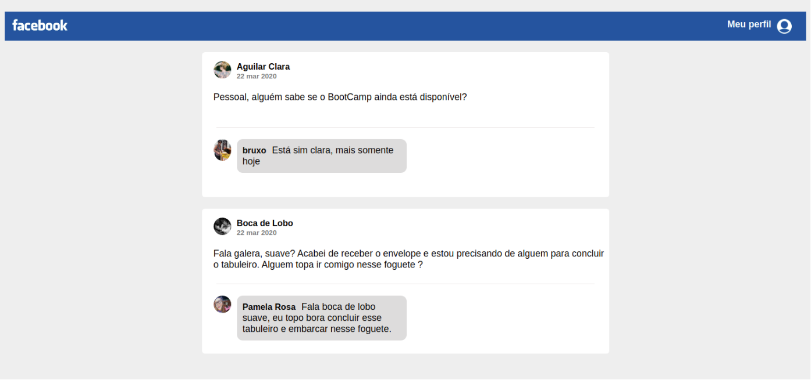

<h1 align="center">
    
</h1>

<h3 align="center">
  Desafio 4: Introdução ao React
</h3>

### 🎯 Sobre o desafio

Crie uma aplicação do zero utilizando **Webpack**, **Babel**, **Webpack Dev Server** e **ReactJS**.

Nessa aplicação você irá desenvolver uma interface semelhante com a do **Facebook** utilizando React.

As informações contidas na interface são estáticas e não precisam refletir nenhuma API REST ou back-end.

### **Tela da aplicação**

<h1 align="center">
    
</h1>