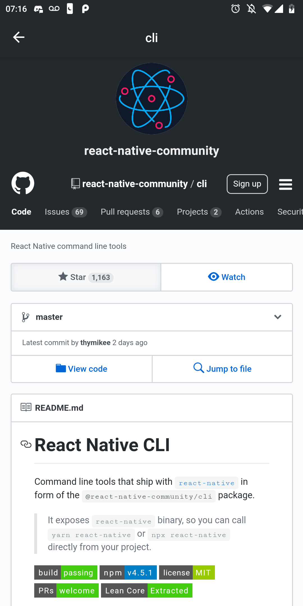
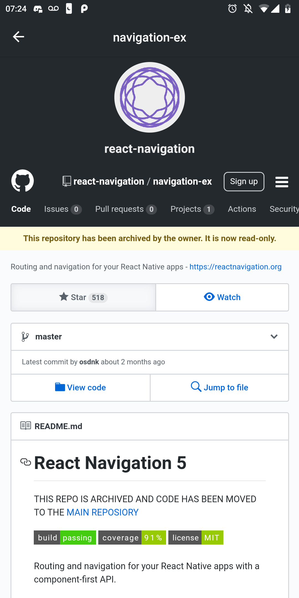

<h1 align="center">
    
</h1>

<h3 align="center">
  Desafio 6: Primeiro projeto com React Native
</h3>

### 🎯 Sobre o desafio

Nesse desafio adicionei novas funcionalidades na aplicação que desenvolvemos ao longo do módulo06.

### **Telas da aplicação**

<h1 align="center">
    
</h1>

<h1 align="center">
    
</h1>
